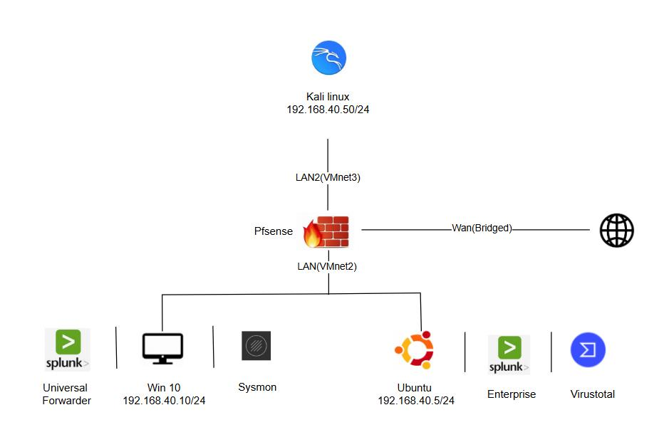
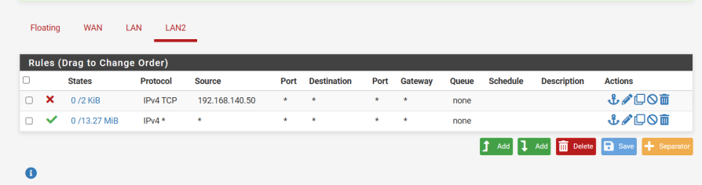
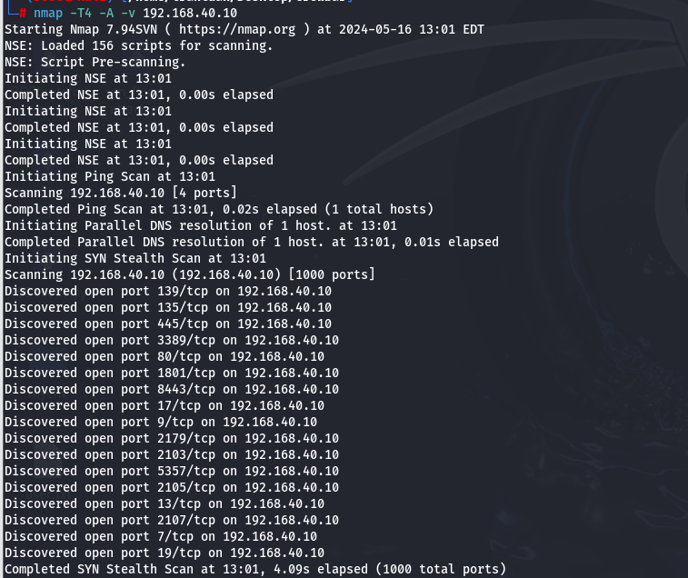
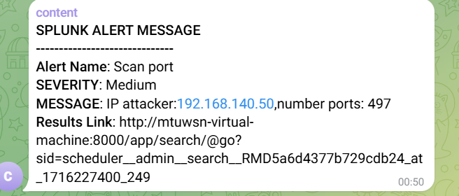
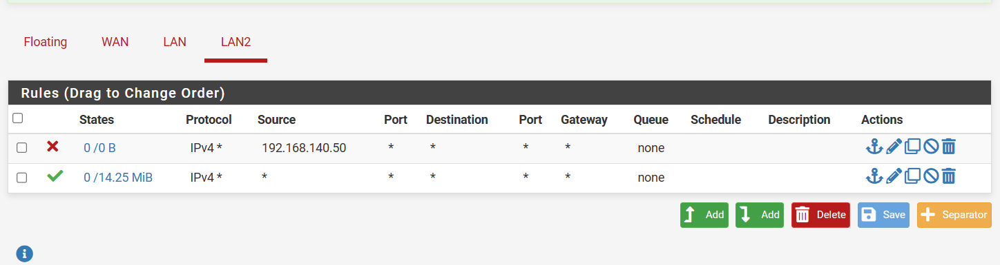
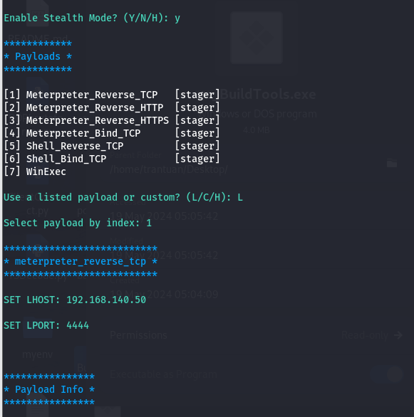
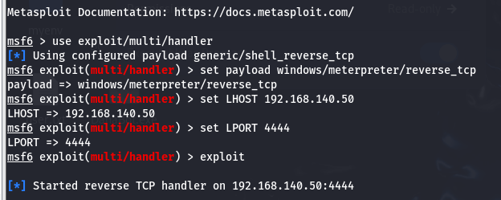
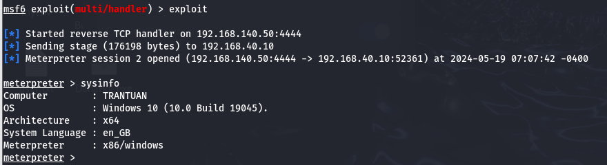
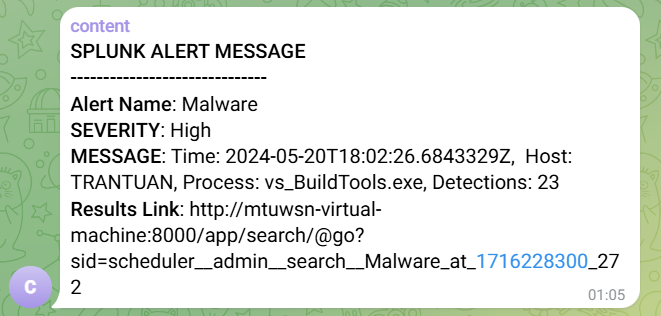

# Nghiên cứu và triển khai giải pháp SIEM dựa trên Splunk
Dự án này tập trung vào việc nghiên cứu và triển khai một hệ thống Quản lý Thông tin và Sự kiện Bảo mật (SIEM) sử dụng công cụ Splunk Enterprise để giám sát, phát hiện và phản ứng tự động với các mối đe dọa an ninh mạng trong một mô hình mạng nhỏ.

## Mô hình triển khai


Cấu hình địa chỉ IP cho từng máy
| Thiết bị | Địa chỉ IP | Mô tả |
| :--- | :--- | :--- |
| Ubuntu | 192.168.40.5 | Cài đặt Splunk Enterprise có tích hợp Virustotal. |
| Windows 10 | 192.168.40.10 | Cài đặt Splunk Universal Forwarder và Sysmon. |
| Kali linux | 192.168.140.50 | Dùng để mô phỏng tấn công. |
| Pfsense | WAN:192.168.0.106/24 <br> LAN:192.168.40.100/24 <br> LAN2:192.168.140.100/24 | Dùng để kết nối mạng bên trong với bên ngoài, chặn IP của attacker. |

## Quy trình thu thập logs
* Thu thập Log Windows/Sysmon: Splunk Universal Forwarder trên máy Win 10 thu thập Windows Event Logs (Security, Application, System, Forwarded Events, Setup Logs) và Sysmon Logs (tạo tiến trình, kết nối mạng, ...). 
* Thu thập Log Tường lửa: Tường lửa PfSense được cấu hình để gửi Firewall Events dưới dạng syslog đến cổng UDP 514 trên Splunk Indexer. 
* Lập chỉ mục và phân tích: Splunk Indexer trên máy Ubuntu nhận dữ liệu, chuẩn hóa, và lập chỉ mục. Splunk Search Head dùng ngôn ngữ SPL (Search Processing Language) để tìm kiếm, tương quan và tạo cảnh báo.

## Các kịch bản tấn công và phát hiện
Triển khai 3 kịch bản tấn công chính để kiểm tra khả năng phát hiện và phản ứng tự động của hệ thống SIEM dựa trên Splunk.

### 1. Tấn công Brute Force
Tấn công brute force cổng 3389 (RDP)


#### Rule detect:

```
index="writelogs" source="WinEventLog:Security"
EventCode=4625 Logon_Type=3 | bin _time span=5m | stats
count by _time, ComputerName, Source_Network_Address |
where count >= 100
```

Theo dõi sự kiện đăng nhập thất bại, có Event Code 4625. Nếu có lớn hơn 100 lần đăng nhập trong 5 phút thì gửi thông báo đến admin.


#### Phản ứng tự động:
Khi phát hiện ra máy bị brute force thì lập tức tường lửa sẽ được thêm 1 rule mới để chặn IP này.


### 2. Tấn công dò quét cổng
Sử dụng nmap để dò quét các cổng của máy Windows có IP 192.168.40.10


#### Rule detect:
```
index="pfsense" dst_ip = "192.168.40.10" | bin _time
span=5m | stats dc(dst_port) as number_port by _time
Source_Network_Address | where number_port > 300
```
Câu lệnh này sẽ tìm kiếm các địa chỉ IP tương tác với hơn 300 ports của máy win 10 trong vòng 5 phút. Và sẽ gửi alert đến admin qua telegram bot.


#### Phản ứng tự động:
Khi phát hiện ra máy bị scan port thì tự động thêm rule block IP này vào tường lửa PfSense. 


### 3. Phát hiện mã độc
Tạo mã độc bằng cách chèn payload revershell vào một phần mềm có sẵn. Dùng công cụ Shellter để chèn payload Metasploit vào file exe.


Tạo listener
 

Khi kích hoạt file exe thì sẽ có shell gửi về máy tấn công


Đồng thời sẽ có alert về admin


#### Rule detect:
Sử dụng app VT4Splunk để tích hợp dịch vụ Virustotal vào Splunk. 
```
index="writelogs"| vt4splunk hash=SHA256 | search
vt_detections > 0
```
VirusTotal có thể phát hiện file độc hại chỉ từ giá trị băm SHA256 vì mỗi file khi tạo ra đều có một hash duy nhất. VirusTotal sở hữu một cơ sở dữ liệu khổng lồ chứa hàng tỷ hash của các mẫu mã độc đã được upload và phân tích từ trước. Khi Splunk gửi mã băm SHA256 lên VirusTotal, hệ thống chỉ cần tra cứu hash này trong cơ sở dữ liệu mà không cần tải hay phân tích lại file. Nếu hash trùng với một mẫu malware đã biết, VirusTotal sẽ trả về số lượng engine phát hiện mã độc tương ứng.
